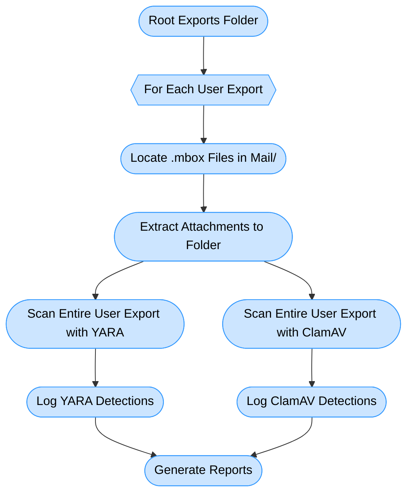

# Google Workspace Export Malware Scanner

---

## Overview

This project automates the extraction of email attachments and malware scanning from **multiple Google Workspace user exports**. It processes Google Takeout-style exports, extracts attachments from `.mbox` files, scans all files with **ClamAV** and **YARA**, and generates detailed per-user and global reports.

---

## Features

- **Batch processing** of multiple user exports
- **Automated extraction** of attachments from `.mbox` files
- **Recursive scanning** of all files, including Drive and extracted attachments
- **Dual malware detection** using ClamAV and YARA
- **Skips `.mbox` files** during scanning to optimize performance
- **Detailed Markdown reports** per user and globally
- **Simple CLI interface** with minimal dependencies

---

## Setup Instructions

### 1. Install Dependencies

- **Python 3.x**
- **ClamAV** and **YARA CLI**

On Debian/Ubuntu:

```bash
sudo apt update
sudo apt install clamav yara -y
sudo freshclam
```

### 2. Prepare Environment

(Optional but recommended)

```bash
python3 -m venv venv
source venv/bin/activate
pip install --upgrade pip
```

### 3. Virus Definitions

Update ClamAV signatures:

```bash
sudo freshclam
```

---

## Usage

Run the main script with the **root exports directory** as argument:

```bash
python3 google-export-scan.py /path/to/root_exports_folder
```

- The script will **automatically detect** if the folder contains multiple user exports or a single export.
- It will **extract attachments first**, then **scan all files recursively**.
- Reports will be saved in the root exports directory.

---

## Process Flow



---

## Reports

- **Per-user Markdown reports** saved in each user export folder
- **Global consolidated report** saved in the root exports directory
- Includes:
  - File paths (relative)
  - Detection source (ClamAV or YARA)
  - Malware name or rule matched
  - Scan timestamps and duration

---

## Contribution

Contributions are welcome! Please fork the repo, create a feature branch, and submit a pull request.

---

## License

This project is licensed under the MIT License.
