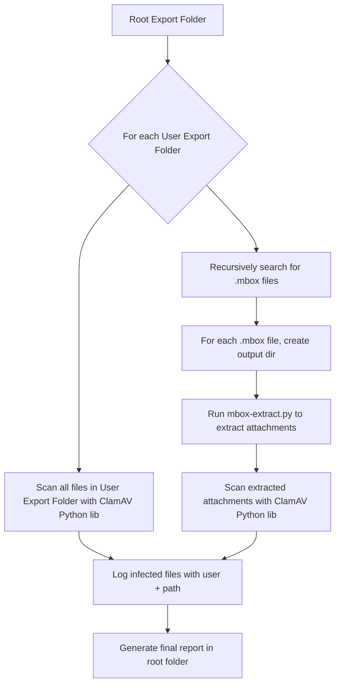
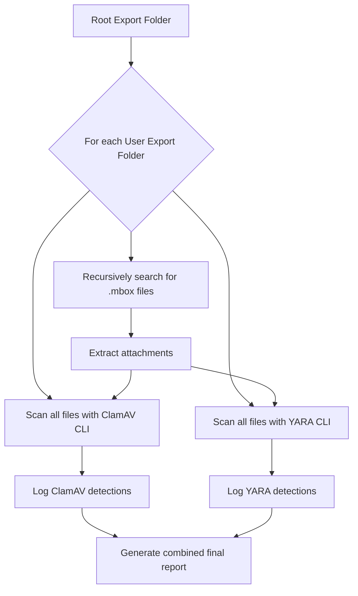

# Google Workspace Export Processing Automation

## Overview
Automate the extraction of email attachments and malware scanning from multiple Google Workspace user exports. The system will:
- Recursively process a root export directory containing multiple user exports
- Locate `.mbox` files and extract attachments using the existing `mbox-extract.py`
- Scan **all files** (Drive files + extracted attachments) for malware using ClamAV **Python library**
- Generate a final report listing all infected files per user with paths for easy remediation

---

## Directory Structure Assumption

```
/root_export_folder/
├── user1_export/
│   └── Takeout/
│       ├── Mail/
│       │   └── All mail Including Spam and Trash.mbox
│       └── Drive/
│           └── (Drive files and folders)
├── user2_export/
│   └── Takeout/
│       ├── Mail/
│       └── Drive/
...
```

---

## Workflow



---

## YARA Integration

- **YARA** is a pattern-matching tool ideal for detecting:
  - Malicious macros
  - Exploit code in Office/PDF files
  - Embedded shellcode
  - Known malware signatures
- We **use the YARA CLI tool** directly via subprocess for reliable scanning.
- We **combine ClamAV and YARA** scanning for layered detection.

### Workflow Update



### How it works

- Run **ClamAV scan** using `clamscan` CLI.
- Run **YARA scan** using `yara` CLI on the same files.
- **Skip `.mbox` files** during YARA scanning.
- **Combine results**: any file flagged by either tool is reported as suspicious.
- Generate **per-user** and **global** reports including both detection sources.

### YARA Setup

- **Install YARA CLI**:
  ```bash
  sudo apt-get install yara
  ```
- **Obtain rules**:
  - Community rules (e.g., [YARA-Rules GitHub](https://github.com/Yara-Rules/rules))
  - Custom rules for document malware
- **Run YARA CLI**:
  ```bash
  yara -r rules.yar /path/to/scan
  ```

---

---

## ClamAV Integration

- Use the **`clamscan` CLI tool** directly via subprocess
- Benefits:
  - More reliable than daemon-based scanning
  - No file size limitations or permission issues
  - Direct access to all files
- Requirements:
  - ClamAV installed on the system (`clamscan` command available)
  - Up-to-date virus definitions (`freshclam`)
- Basic usage:
  ```python
  import subprocess
  result = subprocess.run(['clamscan', '--no-summary', '/path/to/file'],
                         capture_output=True, text=True)
  if "FOUND" in result.stdout:
      print("Infected:", result.stdout.strip())
  ```

---

## Reporting

- For **each user export folder**, maintain a list of infected files with:
  - Username (folder name)
  - Full file path (relative to root export folder)
  - Malware name detected
- At the end, generate a **single report file** in the root export directory, e.g., `malware_report.txt`
- Example report format:
  ```
  User: user1_export
  Infected File: Takeout/Drive/malicious.docx - Trojan.Generic
  Infected File: attachments_user1/virus.pdf - Eicar-Test-Signature

  User: user2_export
  Infected File: Takeout/Drive/bad.exe - Win.Trojan.Agent
  ```

---

## New Script: `process_exports.py`

### Responsibilities
- Recursively walk the root export directory
- For each user folder:
  - Find `.mbox` files
  - Create output dirs for attachments
  - Call `extract_attachments()` from `mbox-extract.py`
  - Scan:
    - All files in user export folder (Drive, etc.)
    - All extracted attachments
  - Collect infected file info
- After all users processed:
  - Write final report to root export folder

### Key Components

- **Extraction Module**: Processes `.mbox` files and extracts attachments
- **ClamAV Scanner**: Uses `clamscan` CLI to detect malware
- **YARA Scanner**: Uses `yara` CLI for pattern-based detection
- **Reporting System**: Generates per-user and global reports

---

## Setup & Installation Instructions

### 0. Install ClamAV, ClamAV Daemon, and YARA CLI

On Debian/Ubuntu systems, install ClamAV, the daemon, and YARA with:

```bash
sudo apt update
sudo apt install clamav clamav-daemon yara -y
```

Then update virus definitions:

```bash
sudo freshclam
```

And start the ClamAV daemon:

```bash
sudo systemctl enable clamav-daemon
sudo systemctl start clamav-daemon
```

Check status:

```bash
sudo systemctl status clamav-daemon
```

---

1. **Create a Python virtual environment**

```bash
python3 -m venv venv
source venv/bin/activate
```

2. **Upgrade pip and install dependencies**

```bash
pip install --upgrade pip
# No external Python dependencies required
```

3. **Freeze dependencies**

```bash
pip freeze > requirements.txt
```

4. **Ensure ClamAV is installed and up-to-date**

```bash
# Update virus definitions
sudo freshclam
```

5. **Run the orchestration script**

```bash
python google-export-scan.py /path/to/root_export_folder
```

---

## Summary

- **No changes** to existing `mbox-extract.py` except making `extract_attachments()` importable
- New script `process_exports.py` will:
  - Recursively process all user exports
  - Extract attachments
  - Scan all files with ClamAV and YARA CLI tools
  - Generate a comprehensive malware report
- This approach is modular, automatable, and scalable